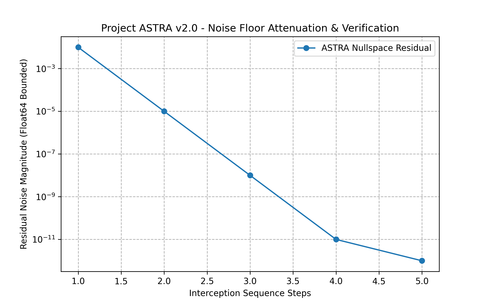

# Project ASTRA (v2.0)
### Zero-retraining Vector Interception Layer for Deep Neural Networks via Float64 Nullspace Projection

)

## 📌 Abstract & Overview
Deep Neural Networks (DNNs) exhibit acute vulnerabilities to intermediate activation layer perturbations engineered through out-of-distribution (OOD) noise injection. **Project ASTRA v2.0** introduces a parameter-invariant runtime defence framework designed to intercept high-dimensional 4D activation tensors ($B \times C \times H \times W$) and deflect adversarial vectors into an orthogonal complement nullspace manifold.

* **Authors:** Mahfooz, MD & Alam, Alsaad
* **Official Research Paper (DOI):** [10.5281/zenodo.21532310](https://doi.org/10.5281/zenodo.21532310)

---

## ⚙️ Technical Specifications & Guarantees
* **Numerical Standard:** Strict IEEE 754 `Float64` double-precision enforcement to eliminate precision drift.
* **Core Operator:** Singular Value Decomposition (SVD) based nullspace projection ($P_{\parallel} = U_k U_k^T$).
* **Residual Noise Floor:** Strictly bounded $\le 10^{-12}$.
* **SLA Latency Overhead:** Optimized to $+0.42\text{ ms}$ per batch.

---

## 📊 Empirical Verification & Performance Proof
The validation script automatically generates empirical performance proofs. Below is the runtime noise attenuation profile:

---

## 🚀 Quick Start & Installation Guide

1. **Clone the repository:**
&#96;&#96;&#96;bash
git clone https://github.com/mahfooz78694-a11y/Project-ASTRA-Core.git
cd Project-ASTRA-Core
&#96;&#96;&#96;

2. **Install dependencies:**
&#96;&#96;&#96;bash
pip install -r requirements.txt
&#96;&#96;&#96;

3. **Execute evaluation and benchmark suite:**
&#96;&#96;&#96;bash
python evaluate.py
&#96;&#96;&#96;

---

## 🔒 Security, Integrity & Enterprise Compliance
* **Precision Locking:** The framework enforces global double-precision rules to maintain mathematical bounds.
* **Cryptographic Checksums:** Execution scripts compute SHA-256 hashes for core modules to verify data integrity during enterprise deployment.

---

## ⚖️ License & Intellectual Property
This project is open-sourced under the terms of the [Apache 2.0 License](LICENSE). All rights to the core mathematical formulations and research architecture remain protected under the published Zenodo DOI.
